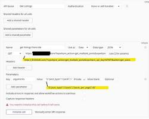
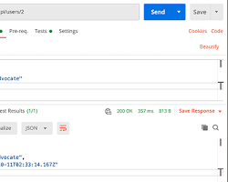

# BÁO CÁO: TÌM HIỂU VÀ THỰC HÀNH CÔNG CỤ KIỂM THỬ POSTMAN

* **Họ và tên:** [Nguyen Van Thanh]
* **Mã số sinh viên:** [23010764]
* **Lớp:** [Định giá và kiểm định chất lượng Cour01.LT5]

---

## 1. Giới thiệu tổng quan về Postman
Postman là một công cụ (Tool) phổ biến hàng đầu hiện nay dành cho lập trình viên và kiểm thử viên (Tester) để làm việc với API (Application Programming Interface). Postman hỗ trợ gửi các request HTTP và kiểm tra dữ liệu phản hồi một cách trực quan, nhanh chóng.

### Các thành phần chính đã tìm hiểu:
* **HTTP Methods:** GET (Lấy dữ liệu), POST (Tạo mới), PUT (Cập nhật), DELETE (Xóa).
* **Collections:** Thư mục dùng để nhóm và quản lý các Request liên quan đến nhau.
* **Params & Body:** Nơi truyền tham số và dữ liệu gửi lên Server.
* **Response:** Kết quả trả về từ Server bao gồm Status Code (Mã trạng thái), Body (Dữ liệu), Time (Thời gian phản hồi).

---

## 2. Tài liệu nghiên cứu và học tập
Ngoài video hướng dẫn được giao, em đã tìm hiểu thêm một số tài liệu phù hợp để nâng cao kiến thức:
1.  **Video bài học:** [Học Postman qua YouTube](https://www.youtube.com/watch?v=MFxk5BZulVU)
2.  **Tài liệu chính thức:** [Postman Learning Center](https://learning.postman.com/) (Trang chủ Postman).
3.  **Blog công nghệ:** Các bài viết hướng dẫn kiểm thử API trên Viblo và Blog TopDev.

---

## 3. Kết quả thực hành và Minh họa bằng hình ảnh

### 3.1. Giao diện tổng quan của ứng dụng Postman
Sau khi cài đặt thành công, đây là giao diện làm việc (Workspace) chính của Postman:

*(Bạn hãy chụp ảnh giao diện Postman của bạn, đặt tên là `giao-dien.png` và chèn vào đây)*
.png](https://encrypted-tbn2.gstatic.com/images?q=tbn:ANd9GcSyyDHIVyke-FKfw3HdrQjS4jsmmgugcDWmHRVv9cOUVjw69q7My84DYDhd_rxD))

### 3.2. Thực hiện phương thức GET Request (Lấy dữ liệu)
Thử nghiệm gửi một Request dạng `GET` tới API giả lập: `https://jsonplaceholder.typicode.com/posts/1`
* **Kết quả:** Hệ thống trả về dữ liệu định dạng JSON thành công với mã lỗi **Status: 200 OK**.

*(Bạn hãy chụp ảnh kết quả chạy request GET thành công, đặt tên là `ket-qua-get.png` và chèn vào đây)*

### 3.3. Tạo và quản lý Collection
Tạo một bộ sưu tập (Collection) tên là `Postman_Assignment` để gom nhóm các yêu cầu kiểm thử lại với nhau, giúp quản lý bài tập khoa học hơn.

*(Bạn hãy chụp ảnh danh sách Collection bên cột trái Postman, đặt tên là `collection.png` và chèn vào đây)*

---

## 4. Kết luận và Bài học rút ra
* Nắm vững quy trình gửi request và kiểm tra dữ liệu trả về (Response) của API.
* Hiểu rõ ý nghĩa của các mã trạng thái phổ biến (200 OK, 201 Created, 404 Not Found, 500 Internal Server Error).
* Biết cách tổ chức và quản lý dự án kiểm thử bằng tính năng Collection của Postman.
